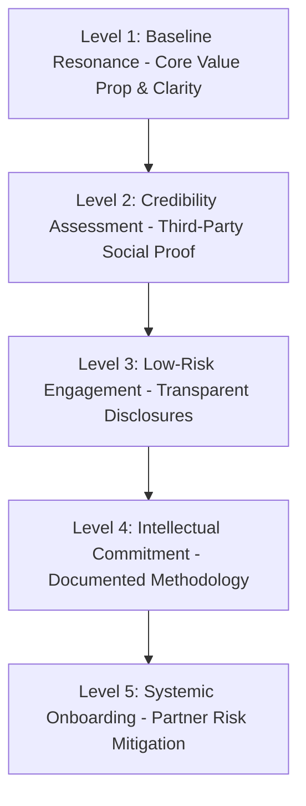

# B2B Trust & Credibility Blueprint: The Psychology of Certainty

## 1. Executive Summary & "The Big Idea"

In high-ticket B2B sales, the bottleneck to conversion is rarely feature availability or pricing; it is **skepticism**. When a premium prospect lands on a B2B website, they bring accumulated scar tissue from agencies that over-promised, systems that crashed in production, and consultants who hid behind complex jargon.

For a firm like **Pipeline Engineers**, the target COO, founder, or VP of Operations is not buying automation scripts, database integrations, or technical labor. **They are buying the feeling of absolute certainty.** They want to look at a website and immediately feel: *"These people operate with the precision, structure, and accountability of elite civil engineers. If I hand my operational pipeline to them, it will not fail. I will sleep soundly at night."*

This research combines the UX heuristics of the **Nielsen Norman Group (NNG)**, conversion methodologies of **CXL**, and the premium editorial architecture of **Ellevest** to establish a definitive blueprint for earning extreme trust instantly.

---

## 2. The NNG Hierarchy of Trust (Adapted for B2B)

Nielsen Norman Group outlines a 5-level **Pyramid of Trust** modeled after Maslow’s hierarchy. A B2B website must satisfy the foundational layers before demanding high-commitment actions (like booking a 45-minute discovery call).

### Level 1: Baseline Resonance (First 10 Seconds)
*   **The Buyer's Mindset**: *"What is this, who is it for, and will it waste my time?"*
*   **Trust Requirement**: Absolute typographic clarity. A B2B visitor who cannot determine what a company does and for whom within the first ten seconds will exit. No abstract metaphors; clear, authoritative, zero-clutter hero layouts.

### Level 2: Credibility Assessment
*   **The Buyer's Mindset**: *"Are they real, are they stable, and have they solved my exact problem before?"*
*   **Trust Requirement**: Third-party validation. Unbiased press strips, client logos, certifications, and highly detailed case studies (not generic quotes, but auditable metrics).

### Level 3: Low-Risk Engagement
*   **The Buyer's Mindset**: *"What is the catch? What are the pricing bounds? How much friction is involved?"*
*   **Trust Requirement**: Up-front disclosures. Transparent fee structures, contract minimums, and direct contact avenues. The absence of gated pricing or opaque barriers projects a powerful signal of honesty.

### Level 4: Intellectual Commitment
*   **The Buyer's Mindset**: *"Do they have a systematic approach, or are they making it up as they go?"*
*   **Trust Requirement**: A deeply documented, proprietary, and auditable delivery framework (e.g., "The Pipeline Delivery System"). When a business demonstrates their methodology in detail, they convert the service from a variable human craft into a reliable product.

### Level 5: Systemic Onboarding (The Transition)
*   **The Buyer's Mindset**: *"If I book a call, will I be hounded by a pushy salesperson?"*
*   **Trust Requirement**: Safe conversion paths. Highly humanized team bios showing the exact expert they will speak with, a direct Calendly schedule link on the card, and an explicit "no-hard-sales, purely diagnostic" commitment.

---

## 3. The CXL Trust Heuristics & Trust Equation

According to conversion optimization research from CXL, website credibility relies heavily on five pillars. We represent this through the **Ultimate Credibility Equation**:

$$\text{Trust} = \text{Clarity} + \text{Credibility} + \text{Relevance} + \text{Usability} + \text{Proof}$$

1.  **Clarity (The Anti-Jargon Rule)**: Prospects do not trust what they do not understand. Complex corporate buzzwords ("synergistic paradigm-shifting ecosystems") breed suspicion. Clear, matter-of-fact language signals true expertise.
2.  **Credibility (EEAT - Experience, Expertise, Authoritativeness, Trustworthiness)**: Demonstrated by credentials (e.g., CFP®, CDFA®, PMP, or certified systems engineers) and institutional stability.
3.  **Relevance (Customized Framing)**: The site must speak to the specific emotional scar tissue of the buyer persona (e.g., naming the fear of system failure during vacations).
4.  **Usability (Performance as a Proxy)**: A site that is slow, has broken mobile elements, or exhibits layout shifts projects operational sloppiness. If you cannot build a clean website, a prospect assumes you cannot build clean business pipelines.
5.  **Proof (High-Credibility Testimony)**: Testimonials must be highly specific, featuring full names, headshots, verifiable roles, and links to the client's LinkedIn profiles to eliminate any doubt of fabrication.

---

## 4. The B2B Credibility & Trust Evaluation Rubric

This 1-5 diagnostic rubric allows B2B firms to mathematically audit their website's trustworthiness across key conversion pillars.

### The Scoring Matrix

| Score | Value Prop & Clarity | Up-front Disclosures | Visual & Technical Polish | Testimonial & Social Proof | Friction & CTA Strategy |
|:---:|---|---|---|---|---|
| **1** | Vague, abstract tagline. Buyer cannot identify services in 15s. | No pricing, zero transparency. Buyer must "Request a Quote" to know anything. | Formatting bugs, broken mobile responsive layout, stock photography. | No testimonials, or vague quotes from anonymous sources (e.g., "John S."). | Hard-sales pushy CTAs. Exit-intent popups and aggressive urgency timers. |
| **2** | Overly technical or jargon-heavy. Confuses features with outcomes. | Opaque packaging. Mentions fees are "custom" with no floor or minimum bounds. | Clean but generic template. Heavy use of cliché vector icons and stock graphics. | Vague testimonials praising the company rather than countering specific objections. | Multiple competing CTAs (e.g., "Get Ebook," "Book Demo," "Free Consultation"). |
| **3** | Clear description of services but lacks strong positioning against status quo. | Discloses pricing but hides fees behind inner pages or secondary tabs. | Clean custom layout. Standard sans-serif fonts, good but unexciting color scheme. | Credible client testimonials with full names, but missing photos or specific metrics. | Single primary CTA but requires filling a long, 8-field lead capture form. |
| **4** | Bold, clear positioning that names the status quo's failure. Proves deep domain. | Clear floor minimums and pricing structures disclosed directly on main paths. | High-production design. Elegant variable typography, generous white space, custom photography. | Rich testimonials containing exact metric improvements and specific objection handling. | Single, zero-friction primary CTA (e.g., "Book a 15-minute call") with no forms. |
| **5** | **Surgical positioning. Invented category/vocabulary that shifts industry paradigm.** | **Total radical transparency. Open methodologies, pricing floor, and legal ADV disclosures.** | **Pentagram-level custom editorial design. Glassmorphism, tailored HSL colors, Lenis scroll.** | **Verified client testimonials with photos, LinkedIn profiles, and auditable outcome statistics.** | **Direct scheduling integration on individual advisor/engineer cards. Complete CTA restraint.** |

---

## 5. 20 Ways to Improve B2B Website Credibility & Trust

These 20 actionable strategies are tailored to the **Pipeline Engineers** brand identity, utilizing a high-luxury, warm neutral editorial system (**Brand Cashmere `#f7f5f0`**, **Brand Green `#537a44`**, and **Brand Burgundy `#441e1e`**), drawing inspiration from the psychological architecture of Ellevest.

### Category A: Visual Polish & Layout Architecture
1.  **Adopt a Tactile Editorial Canvas**: Ditch cold, clinical pure white (`#ffffff`) or sterile digital grays. Use **Brand Cashmere (`#f7f5f0`)** as a warm neutral background. It feels premium, established, and acts as a tactile canvas that resembles high-end print publishing.
2.  **Command Space with Extreme Whitespace**: Use massive vertical padding (e.g., `120px` desktop sections). Brands that pack elements tightly project panic and desperation. Generous whitespace communicates: *"We are highly successful; we do not need to cram layout grids to beg for your attention."*
3.  **Deploy Variable Serif Display Typography**: Set hero display headlines in an elegant serif like **Fraunces** or **Freight Display** at heavy weights, and body copy in a highly readable geometric sans-serif (**Inter** or **DM Sans**). Serifs project history, editorial gravitas, and deep intellect, while clean sans-serifs communicate execution.
4.  **Use JetBrains Mono for Technical Credibility**: Render technical specifications, performance metrics, sitemaps, process steps, and data grids in a clean monospaced font like **JetBrains Mono**. Monospace visually screams "engineering rigor," giving mathematical credibility to claims on sight.
5.  **Develop a Consistent Cast Narrative**: Feature the same 2-3 real clients/protagonists in photography across multiple pages. The client's face becomes familiar, building structural continuity and comforting safety as the prospect scrolls the site.
6.  **Eliminate Corporate Stiff Photography**: Avoid cold office conference tables, suits, or handshakes. Use warm, domestic wood tables, natural light, and natural interaction photography. In premium B2B, the client should look relaxed and resolved—implying the hard work has already been completed by the engineers.

### Category B: Copy, Positioning, & Disclosures
7.  **Invent and Own Your Category Vocabulary**: Rather than calling yourself a "B2B operations agency" (highly generic), define a unique, high-trust compound term like **"Operational Infrastructure"** or **"Pipeline Engineering."** Reinforce it until it becomes a baseline standard in the buyer's mind.
8.  **Indict the Status Quo Immediately**: Name the exact failure mode of standard operations consultants or agencies above the fold.
    *   *Pipeline Engineers Copy*: *"Most operations agencies treat your business like a temporary project. We treat it like critical physical infrastructure. Traditional agencies build temporary fixes. We build systems that hold. Always."*
9.  **Disclose Minimums and Fees Upfront**: Do not hide transaction thresholds. State them clearly near your CTA.
    *   *Copy Pattern*: *"Full Operational Infrastructure deployments for mid-market systems with $50,000 or more in targeted budget, and standalone diagnostic pipeline audits available for a flat $4,500."*
10. **Target the Existential Outcome in Testimonials**: Instead of using testimonials that praise your speed or general work, highlight quotes that address the emotional relief of your buyer (e.g., defusing the fear of system failure).
    *   *Copy Pattern*: *"I used to feel extreme anxiety every time a key systems engineer went on vacation. With Pipeline Engineers, our infrastructure is so structured that I finally sleep soundly at night."*
11. **Inject Regulatory and Compliance Disclosures**: Prominently display security certifications (SOC2, ISO), formal engineering methodologies, and legal term frameworks on the page. Do not hide them; treat regulatory adherence as a central trust asset.
12. **Link to a Proprietary Operational Methodology**: Feature a highly detailed page mapping your exact delivery system (e.g., "The 5-Stage Pipeline Delivery Engine"). By documenting your process step-by-step, you show that your results are systemic and repeatable, not lucky or manual.

### Category C: Social Proof & Verifiability
13. **Bind Testimonials to Client LinkedIn Profiles**: Place a clean, minimal LinkedIn icon next to client names in testimonials, linking directly to their active profiles. This shows absolute confidence that your reviews are from real, highly respected executives who stand by your work.
14. **Quantify Proof with Surgical Monospaced Metrics**: Don't say "we improved efficiency." Say: *"We reduced data pipeline latency from `42.8s` to `1.2s` and automated `84%` of manual ingestion tasks."* The use of exact decimals and monospace layout signals that a real engineer actually measured the outcome.
15. **Display an Unbiased Press & Certification Strip**: Feature neutral gray/slate brand logos of platforms, partners, or security standards that have vetted your team (e.g., Google Cloud, AWS, SOC2). Position this strip immediately below the hero section to anchor credibility before the prospect reads secondary copy.
16. **Adopt Complete CTA Restraint**: Do not use exit-intent popups, countdown clocks, or urgency copy. The primary call-to-action should be a single, consistent action: `Book a discovery call`. The complete absence of marketing pressure is the ultimate signal of premium authority.

### Category D: Conversion & Friction Engineering
17. **Integrate Direct Booking on Team Cards**: Instead of routing prospects to a long, intimidating multi-field contact form, display individual engineer bio cards with a direct `Schedule Call` button. This humanizes the onboarding process and eliminates friction instantly.
18. **Commit to a Purely Diagnostic Discovery Call**: Explicitly state next to scheduling buttons that the discovery session is a zero-pressure, purely technical diagnostic call with a systems engineer—not a pitch meeting with a pushy sales representative.
19. **Secure the Client Entry Point (App Check & SSL)**: Display subtle but clear indicators that all interactions, file submissions, and data connections on the website are fully protected by advanced encryption (SSL) and secure access controls (e.g., Firebase App Check).
20. **Link Out confidently to Industry Resources**: Do not be afraid to link directly to external, highly authoritative third-party resources (e.g., official documentation, Git repositories, or industry standards). Outbound links prove you are confident in your expertise and connected to the wider technological community.
