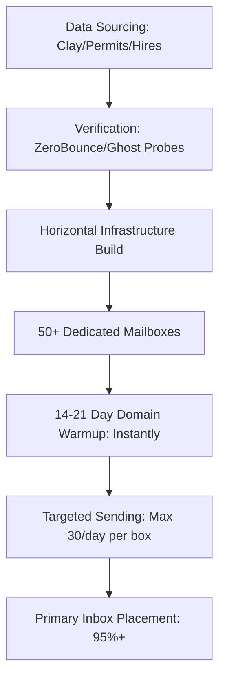

# ScaleSteady: Company Profile & Strategic Architecture
*Comprehensive Master Brief on ScaleSteady's Outbound Lead Generation Model, Technical Architecture, and Messaging Playbooks.*

---

## 1. Executive Summary & Value Proposition

**ScaleSteady** (operating online at [scalesteady.pro](https://scalesteady.pro)) is an elite B2B growth agency that designs, implements, and operates custom **Autonomous Growth Engines** (high-velocity, hyper-personalized cold email and outbound infrastructure) specifically for high-ticket service industries.

Instead of running traditional, low-intent digital ads or relying entirely on unpredictable word-of-mouth referrals, ScaleSteady builds an "owned pipeline asset" for clients that identifies commercial decision-makers showing live buying signals and reaches them with highly tailored, one-to-one outreach.

### The ScaleSteady Core Promise:
*   **100% Done-For-You (DFY) Execution:** Sourcing, infrastructure configuration, copy curation, warmup, sending, and follow-up are fully managed.
*   **Risk Reversal Offers:** Hybrid performance models, free audits, and month-to-month contracts.
*   **Direct to Decision-Makers:** Bypasses social media and residential search traffic to capture B2B contracts directly.
*   **Clean Hand-off:** Warm, qualified responses land in the client's inbox; they only focus on closing the work.

---

## 2. Target Industry Verticals & Market Pains

ScaleSteady targets sectors with **high contract values**, **low digital outbound competition**, and **high traditional customer acquisition costs (CAC)**.

### A. Medical Spas & Aesthetics (Branded as *InceptionEmails*)
*   **The Sector:** $25B+ market, heavily fragmented (81% independent single-location practices run by Nurse Practitioners or Medical Directors).
*   **The Nightmare:** 
    *   **"Groupon Hangover":** Discount deal sites bleed margins, attract low-intent "tire-kickers," and risk state-level fee-splitting legal violations.
    *   **The No-Show Epidemic:** Blended web-form leads see up to 30% ghost/no-show rates.
*   **ScaleSteady's Closed-Loop Solution:** targeted B2B outbound combined with an automated consultation deposit funnel ($50–$100) to filter for high-show commitment.

### B. Commercial HVAC Contractors
*   **The Sector:** Massive commercial HVAC market ($49B+ in the U.S.).
*   **The Nightmare:** 
    *   **Google Ads / LSA Hyper-Inflation:** Commercial keywords cost $8–$30+ per click with blended cost-per-lead (CPL) sitting at $80–$180 in competitive metros.
    *   **Uncontrollable Flow:** Relying entirely on LSAs or local algorithms that Google can modify overnight.
*   **ScaleSteady's Solution:** Sourcing commercial contracts via real-time construction permits and expansion triggers, targeting property managers at 1/5th the cost of ads.

### C. Commercial Flooring Contractors
*   **The Sector:** $74B global market with extremely low modern digital adoption.
*   **The Nightmare:** Saturated trade-shows, heavy referral dependency, and reactive sales cycles.
*   **ScaleSteady's Solution:** Hyper-personalized outbound targeting general contractors, developers, and corporate facility leads.

### D. Equipment Leasing & Finance
*   **The Sector:** $1.02T industry.
*   **The Nightmare:** Legacy sales cycles and highly competitive, generic SEO battles.
*   **ScaleSteady's Solution:** Reaching equipment buyers based on financing expansions and active corporate projects.

---

## 3. The Technical Delivery Engine

ScaleSteady separates itself from amateur email marketers by engineering **robust deliverability infrastructure** as a systemic asset.

### 3.1 Deliverability Protocol
*   **Horizontal Scaling:** Rather than blasting high volume from a single domain, ScaleSteady deploys 50+ secondary domains/mailboxes. Each mailbox sends only 30 emails daily to mimic natural human behavior.
*   **Full DNS Authentication:** Manual and programmatic injection of custom SPF, DKIM, and DMARC protocols.
*   **Pre-Flight Domain Warm-up:** Mandatory 14–21 day automated warmup cycles (via Instantly.ai) before any live prospect receives an email.
*   **Custom Tracking Domains (CTDs):** Segregated tracking to prevent generic server blacklisting.

### 3.2 Signal-Based Data Sourcing
Instead of stale databases, ScaleSteady uses advanced APIs and programmatic scrapers (Clay.com, custom government databases, etc.) to target companies experiencing active trigger events:
1.  **Construction Permits:** Finding GCs or building owners initiating high-value builds.
2.  **Hiring Surges:** Companies hiring technicians, indicating capacity expansion.
3.  **Recent 5-Star Reviews:** Scraping names and sentiments to personalize the opener.

---

## 4. The Copywriting Framework

ScaleSteady's outreach copy utilizes a strategic blend of two premier marketing frameworks: **Nick Saraev (Automated Empathy)** and **Alex Hormozi (Grand Slam Risk Reversal)**.

### Nick Saraev: Technical Empathy
*   **Core Principle:** Leverage deep data scraping to simulate hyper-personalized, 1-on-1 letters.
*   **Execution:** Scrape the clinic's or contractor's most recent 5-star Google Review or specific project location.
*   *Example:* *"Hey [Name], saw your work at [Location] won that contract with [GC]—awesome work. I run a commercial outreach team..."*

### Alex Hormozi: Risk Reversal & Asymmetric CTAs
*   **Core Principle:** Pitch low-friction, asymmetric value rather than demanding a sales call. Maintain "High-Status Parity" (never sound defensive or apologetic).
*   **CTAs & Lead Magnets:**
    *   *The Loom Audit Drop:* A brief, personalized walkthrough showing a gap in their local outreach.
    *   *The Reverse Lead Magnet:* *"Would it be a complete waste of your time if I put together a free market audit showing commercial contracts currently invisible in your market? No call required."*
    *   *Grand Slam Guarantees:* *"We bring you 8 exclusive, pre-vetted consultations this month, or we work for free until we do."*

---

## 5. Economic & Pricing Models

ScaleSteady moves away from generic, easily-refused retainers to align directly with client incentives using a **Hybrid Performance Model**:

| Fee Component | Target Value | Positioning / Utility |
|:---|:---|:---|
| **Setup Fee (Infrastructure Build)** | $1,500 – $2,500 | Pays for domain purchases, email account licenses, cold warmup tools, and custom data scraping setup. |
| **Performance Trigger** | $250 – $450 | Charged *only* per "Showed High-Ticket Consultation." Aligns agency profit directly with delivery. |

---

## 6. Synthesis of ScaleSteady's Operational Advantages

| Feature | Legacy Outreach (Referrals / Ads) | ScaleSteady Outbound Engine |
|:---|:---|:---|
| **Platform Risk** | High (Google/LSA algos, ad cost inflation) | Zero (Owned domains, direct SMTP access) |
| **Cost Per Lead (HVAC)** | $80–$180 (Google Ads CPL) | $15–$40 (Programmatic CPL) |
| **Audience Focus** | Red Ocean (Fighting over active searchers) | Blue Ocean (Securing deals before they search) |
| **Automation Level** | High Owner Hustle (Self-sales team) | 100% Autonomous (DFY pipeline creation) |
| **Outbound Competition** | High (Social/FB ads) | Near Zero (Targeted inbox delivery) |

---
*Dossier compiled by Antigravity AI Systems. Source datasets derived from live website parsing (`scalesteady.pro`), internal dossiers (`InceptionEmails`), and cold call toolkit files in `/scratch`.*
