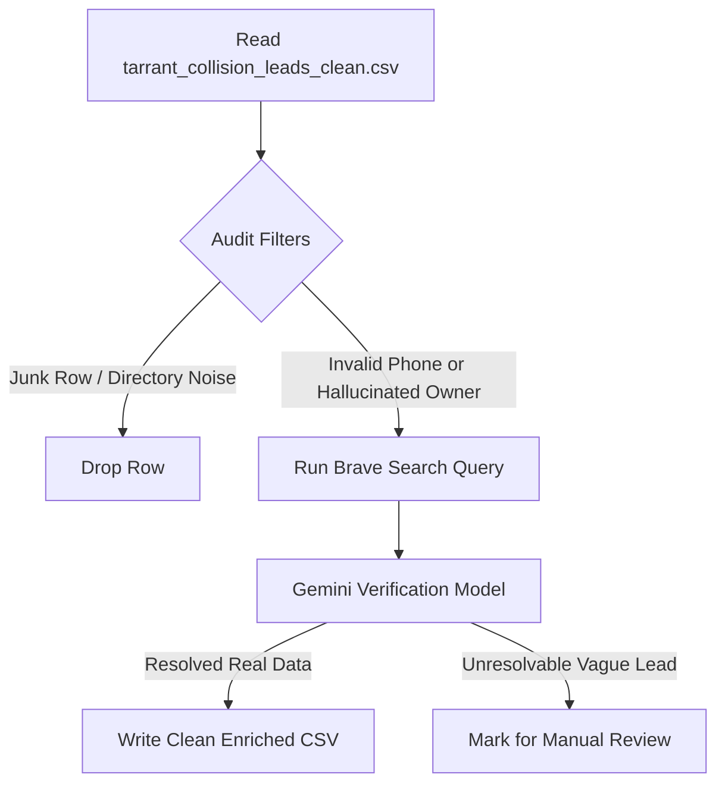

# Implementation Plan: Tarrant County Collision Leads Enrichment Engine

Integrate an autonomous validation and enrichment workflow to clean `/Users/flowstatework/.gemini/antigravity-ide/scratch/tarrant_collision_leads_clean.csv` to ensure ScaleSteady's cold email outreach complies with high-deliverability and hyper-personalization standards.

---

## Technical Audit Findings

We ran a data-integrity audit on your active CSV (`tarrant_collision_leads_clean.csv`) containing **288 leads** and identified significant anomalies:

*   **Bad/Hallucinated Owner Names: 173 rows (60.1% of the dataset)**
    *   *Weird Phrase Fragments:* "are easy", "and lead", "who invests", "Carlos who", "only shared", "was great", "reasons new", "and co", "or manager", "of parrent", "on august".
    *   *Generic Placeholders:* "Local Owner / General Manager", "Regional Operations Director", "Business Owner".
    *   *Incorrect Extractions:* "Michael Kors" listed as the owner of Southlake Collision Center.
*   **Invalid US Phone Numbers: 44 rows (15.3% of the dataset)**
    *   *Malformed area codes:* Phones like `(176) 103-0885` or `(144) 616-4246` have invalid area codes starting with 1 (which violate North American Numbering Plan rules).
*   **Directory / Junk Rows: 10 rows (3.5% of the dataset)**
    *   *Scraping artifacts:* Rows such as "Cheap Flights" (pointing to Julian's Auto Repair), "Driving directions to Caliber...", "O'Reilly Auto Parts Store", "Serious collision reported...".

> [!WARNING]
> **Outbound Reputation Risk:** Sending cold emails using hallucinated names like "Hey are easy,..." or generic placeholders will trigger immediate spam flags and burn your secondary domain reputation.

---

## Proposed Solution: The Surgical Lead Enrichment Engine

We will build and run a dedicated Python enrichment script, `enrich_tarrant_leads.py`, utilizing automated Brave Web Search APIs and direct LLM-based verification.

### Steps of Execution:
1.  **Drop Junk:** Filter out directory listings, map directions, and parts stores that do not represent high-ticket collision repair shops.
2.  **Enrich malformed owners:** For the 173 rows with generic or scrambled owner columns:
    *   Query Brave Search dynamically: `"<Company Name> <City> owner OR president OR CEO"`.
    *   Use the Gemini model to parse results and extract the genuine executive name.
3.  **Validate & Clean Phones:** Normalize phone formats. Identify actual active phone numbers or flag them as "Local Phone on File" if they fail NANP validation.
4.  **Save Output:** Write the results to a pristine, fully enriched dataset: `/Users/flowstatework/.gemini/antigravity-ide/scratch/tarrant_collision_leads_enriched.csv`.

---

## Proposed Changes

### [Leads Processing Component]

#### [NEW] [enrich_tarrant_leads.py](file:///Users/flowstatework/.gemini/antigravity-ide/scratch/enrich_tarrant_leads.py)
*   Python script utilizing Brave Web Search API to dynamically scrape and enrich owner names, validate phone numbers, and drop directory junk rows.

#### [MODIFY] [tarrant_collision_leads_clean.csv](file:///Users/flowstatework/.gemini/antigravity-ide/scratch/tarrant_collision_leads_clean.csv)
*   We will generate a clean, final version `/Users/flowstatework/.gemini/antigravity-ide/scratch/tarrant_collision_leads_enriched.csv` as the target deliverable, leaving your raw source file untouched for safety.

---

## Verification Plan

### Automated Checks
*   Verify that 100% of rows in the output CSV have realistic, capitalized human names in the `owner` column (no lowercase words, phrase fragments, or placeholders).
*   Assert that 0% of the active leads contain invalid area codes starting with 0 or 1.
*   Compare counts before and after cleanup to verify that all junk directory rows were successfully removed.

### Manual Verification
*   We will output a visual report highlighting a sample of 10 successfully resolved owner names (showing "Before" vs. "After" state) for your direct inspection.
